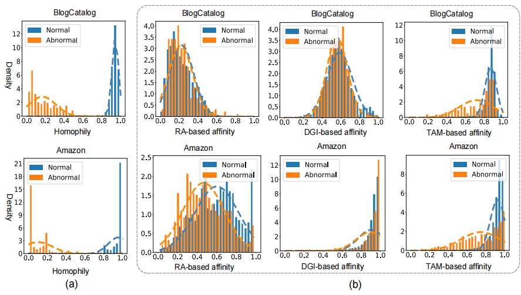
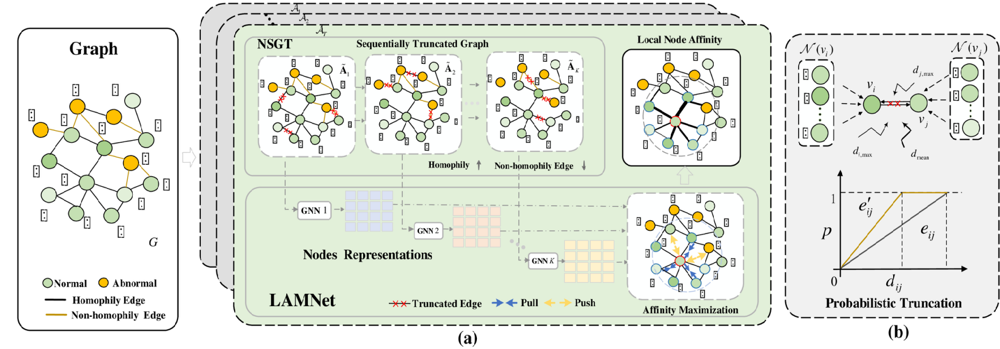

# Truncated Affinity Maximization: One-class Homophily Modeling for Graph Anomaly Detection (NeurIPS'23)

This repository is the official implementation of NeurIPS'23 paper "Truncated Affinity Maximization: One-class
Homophily Modeling for Graph Anomaly Detection"

The full paper can be found at [NeurIPS Portal](https://nips.cc/virtual/2023/poster/70486) or [arXiv](https://arxiv.org/pdf/2306.00006.pdf).


>📋  We explore the  property one class homophily to introduce a novel unsupervised anomaly scoring measure for GAD -- local node affinity -- that assigns a larger anomaly score to nodes that are less affiliated with their neighbors, with the affinity defined as similarity on node attributes/representations.
We further propose Truncated Affinity Maximization (TAM) that learns tailored node representations for our anomaly measure by maximizing the local affinity of nodes to their neighbors.
TAM is instead optimized on truncated graphs where non-homophily edges are removed iteratively to mitigate this bias. Extensive empirical results on six real-world GAD datasets show that TAM substantially outperforms seven competing models
>
>

## Requirements

To install requirements:

```setup
pip install -r requirements.txt
```


>📋  TAM is implemented in Pytorch 1.6.0 with python 3.7 and all the experiments are run on an NVIDIA GeForce RTX 3090 24GB GPU.   For the large-scale graph datasets, T-Finace, Amazon-all, and YelpChi-all, all the experiments are run on NVIDIA A100 GPU. The experiments on OGB-Protein are run on the CPU.

## Datasets
> BlogCatalog and ACM were downloaded from https://github.com/yixinliu233/CoLA <br>
> Amazon and Yelpchi were downloaded from  https://github.com/YingtongDou/CARE-GNN <br>
> Amazon-all and Yelpchi-all were downloaded from  https://github.com/YingtongDou/CARE-GNN <br>
> Facebook is obtained from  https://github.com/zhiming-xu/conad <br>
> Reddit is downloaded from https://github.com/pygod-team/data  <br>
> T-finance is downloaded from https://drive.google.com/drive/folders/1PpNwvZx_YRSCDiHaBUmRIS3x1rZR7fMr <br>
> OGB-Protein is downloaded from https://ogb.stanford.edu/docs/nodeprop/#ogbn-arxiv <br>
For convenience, all the datasets can be obtained from  https://drive.google.com/drive/folders/1qcDBcVdcfAr_q5VOXBYagtnhA_r3Mm3Z?usp=drive_link

## Training

To train the model(s) in the paper, run this command:

```train
python train.py
```

>📋  In TAM, each LAMNet is implemented by a two-layer GCN, and its weight parameters are optimized using Adam optimizer with 500 epochs and a learning rate of 1e-5 by default.  T=3 and K=4 are used for all datasets. Datasets with injected anomalies, such as BlogCatalog and ACM, require strong regularization, so $\lambda=1$ is used by default; whereas $\lambda=0$ is used for the four real-world datasets.
For the larger datasets like Amazon-all, YelpChi-all and OGB-Protein, they require larger truncation times  due to the large number of edges. So we set K = 7.
## Evaluation

To evaluate our model on datasets,  run:

```eval
python train.py 
```

## Results
Our model achieves the following performance on :

| Metric | BlogCatalog | ACM      | Amazon         | Facebook | Reddit | YelpChi | Amazon-all | YelpChi-all |T-finance | OGB-Protein |
|--------|-------------|----------|----------------|----------|--------|--------|--------|--------|--------|--------|
| AUROC  | 0.8248      | 0.8878   | 0.7064         | 0.9144   | 0.6023 | 0.5643 |0.8476 |0.5818	|0.6175|	0.7449|
| AUPRC  | 0.4182      | 0.5124   | 0.2634   | 0.2233  | 0.0446 | 0.0778 |0.4346|	0.1886|	0.0547	|0.2173|


## Main Contributions
We reveal an important anomaly-discriminative property, the one-class homophily, in GAD datasets with either injected or real anomalies. We utilize this property to introduce a novel unsupervised GAD measure, local node affinity, and further introduce a truncated affinity maximization (TAM) approach that end-to-end optimizes the proposed anomaly measure on truncated adjacency  matrix with the non-homophily edges eliminated


## Citation

If you use this package and find it useful, please cite our paper using the following BibTeX. Thanks! :)

```bibtex
@inproceedings{qiao2023truncated,
  title={Truncated Affinity Maximization: One-class Homophily Modeling for Graph Anomaly Detection},
  author={Qiao, Hezhe and Pang, Guansong},
  booktitle={Advances in Neural Information Processing Systems},
  year={2023}
}
```

